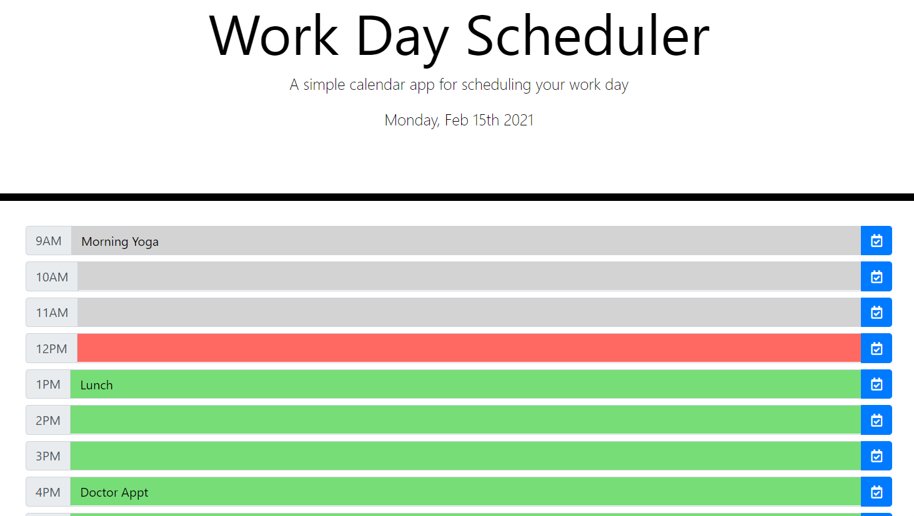

# Selma's HW5 Daily Planner

## Description:

In this activity, I am building a daily planner that utilizes localhost to store daily tasks. In conjunction with Moment JS, I am able to translate times and dates to display the planner with past, present, and future colors (past= grey, present = red, future = green). This is a very handy real world planner I could use on a daily basis. I also did some research on how to translate military time to 12 hour time and vice versa.

## Installation:

- If you need to pull my code for this homework, please visit my Github repository at: https://github.com/selma-e/hw5_daily_planner
- If you want to see the final webpage for my code, please visit my hosted website at: https://selma-e.github.io/hw5_daily_planner/

## Usage:

## Resources Used/Credits:

- https://getbootstrap.com/docs/4.5/getting-started/introduction/
- https://developer.mozilla.org/en-US/docs/Web/API/Window/localStorage
- https://momentjs.com/
- https://fontawesome.com/

© 2020 Selma Elgabalawy | UW-SEA-FSF-PT-08-2020-U-C-TTh
